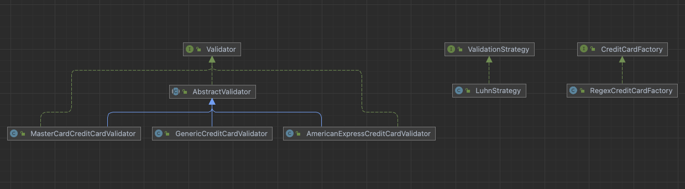
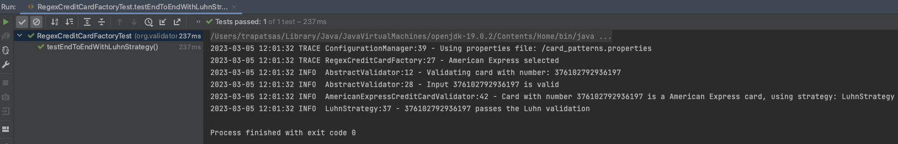
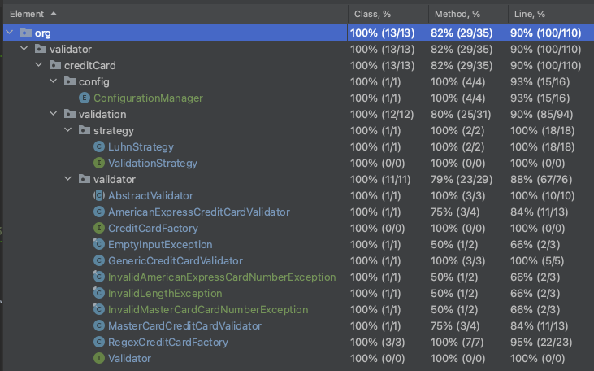

# Solution Overview




The given solution is a credit card validator program. The program uses a set of predefined validation strategies to validate the credit card number, and it supports different types of credit cards such as American Express, MasterCard, and generic credit cards.

The program uses the Strategy design pattern to define a set of validation strategies for validating credit card numbers. The validation strategies are defined as separate classes that implement the ValidationStrategy interface. The LuhnStrategy class is an example of a validation strategy that implements the Luhn algorithm for validating credit card numbers.

It uses the Factory Method design pattern to create instances of credit card validators based on the type of credit card. The RegexCreditCardFactory class is an example of a factory class that creates instances of credit card validators based on the regular expression pattern of the credit card number. The factory class creates different types of validators such as AmericanExpressCreditCardValidator, MasterCardCreditCardValidator, and GenericCreditCardValidator.

The program, also, uses the Template Method design pattern to define a common validation process for all credit card validators. The AbstractValidator class is an example of a template class that defines a common validation process for all credit card validators. The template class defines a set of abstract methods that need to be implemented by concrete validator classes.

Overall, we used a combination of design patterns to create a flexible and extensible solution, that can be easily extended to support new types of credit cards and validation strategies by creating new concrete classes that implement the ValidationStrategy interface and the AbstractValidator class.

Here is the suggested way to use this solution in order to check if a credit card number is valid or not.

```java
RegexCreditCardFactory regexCreditCardFactory = new RegexCreditCardFactory();

String number = "4716 9553 4904 4653";
ValidationStrategy strategy = new LuhnStrategy();

boolean result = regexCreditCardFactory.validateCreditCard(number, strategy).isValid();
```
## Full example



`2023-03-05 12:01:32 TRACE ConfigurationManager:39 - Using properties file: /card_patterns.properties`  
ConfigurationManager loads the validation rules for credit cards from the property file.

`2023-03-05 12:01:32 TRACE RegexCreditCardFactory:27 - American Express selected`  
RegexCreditCardFactory selects the proper validator based on the card type

`2023-03-05 12:01:32 INFO  AbstractValidator:12 - Validating card with number: 376102792936197`  
`2023-03-05 12:01:32 INFO  AbstractValidator:28 - Input 376102792936197 is valid`  
AbstractValidator checks if the input contains at least the required number of digits to qualify for further validations.

`2023-03-05 12:01:32 INFO  AmericanExpressCreditCardValidator:42 - Card with number 376102792936197 is a American Express card, using strategy: LuhnStrategy`  
The concrete implementations run extra validation rules depending on the card type.

`2023-03-05 12:01:32 INFO  LuhnStrategy:37 - 376102792936197 passes the Luhn validation`  
Finally, if all other validations pass, we run the chosen strategy as the last validation step.

## Object-oriented patterns and principles used in the solution

### Design Patterns

* **Factory Method**: The RegexCreditCardFactory class implements the CreditCardFactory interface, which provides a method for creating a credit card validator. The factory uses a regular expression to determine the card type and returns the corresponding validator object. This approach follows the Factory Method pattern, where an object is created by a factory method rather than by a constructor.
* **Strategy**: The ValidationStrategy interface defines a strategy for validating credit card numbers. The LuhnStrategy class implements this interface, providing a strategy for validating card numbers using the Luhn algorithm. The GenericCreditCardValidator class takes a ValidationStrategy object as a parameter and uses it to validate a credit card number. This approach follows the Strategy pattern, where a family of algorithms is encapsulated in separate classes and made interchangeable.
* **Singleton pattern**: The ConfigurationManager class is implemented as a singleton, ensuring that there is only one instance of the class throughout the program. The singleton pattern is implemented using a private constructor and a static method (getInstance) that returns the singleton instance.
* **Template Method**: This pattern is applied in this solution through the AbstractValidator class. The AbstractValidator class defines the skeleton of an algorithm for validating credit card numbers, while leaving the implementation of some steps to its concrete subclasses. The AbstractValidator class contains a template method, validate(), which is responsible for executing the steps of the algorithm in a particular order. By defining the overall algorithm structure in the AbstractValidator class and delegating some of the implementation details to its subclasses, the Template Method pattern allows for code reuse and helps to avoid duplication of code across multiple classes.
* **Polymorphism**:
  * The **ValidationStrategy** interface defines a contract that multiple classes implement, allowing them to be used interchangeably in the GenericCreditCardValidator class.
  * The **CardValidator** interface and the CreditCardFactory interface are also implemented by multiple classes.
* **Abstraction**:
  * The **AbstractValidator** class is an abstract class that defines a common behavior for all concrete credit card validator classes to inherit from.
  * The **ValidationStrategy** interface defines a contract for implementing validation algorithms, without specifying how those algorithms are implemented.
* **Encapsulation**:
  * The **AbstractValidator** class and its concrete subclasses encapsulate the logic for validating credit card numbers and handling exceptions.
  * The **CreditCardFactory** interface and its concrete implementation RegexCreditCardFactory encapsulate the logic for creating credit card validators based on the input card number.
* **Inheritance**:
  * The **AbstractValidator** class is an abstract base class that defines a common behavior for all concrete credit card validator classes to inherit from.
  * The concrete validator classes (AmericanExpressCreditCardValidator, MasterCardCreditCardValidator, GenericCreditCardValidator) inherit from the AbstractValidator class and implement its abstract methods.

### SOLID Principles

* **Single Responsibility Principle (SRP)**: Each class in the solution has a single responsibility, making it easier to understand and maintain. For example, the AbstractValidator class is responsible for validating the credit card number.
* **Open/Closed Principle (OCP)**: The solution is open for extension but closed for modification. New credit card validators can be added to the system without modifying existing code. The RegexCreditCardFactory class can be extended to support additional credit card types by adding a new regular expression and validator.
* **Liskov Substitution Principle (LSP)**: The AbstractValidator class is an abstract class that defines a common interface for all credit card validators. The GenericCreditCardValidator, MasterCardCreditCardValidator, and AmericanExpressCreditCardValidator classes are concrete implementations of this interface, and they can be substituted for each other without affecting the correctness of the system.
* **Interface Segregation Principle (ISP)**: The CreditCardFactory interface defines a single method for creating credit card validators. This interface is focused on a single responsibility and is not overloaded with unnecessary methods.
* **Dependency Inversion Principle (DIP)**: The AbstractValidator class depends on abstractions (i.e., the CreditCardFactory and ValidationStrategy interfaces) rather than on concrete implementations. This approach makes the system more flexible and easier to extend.

### Logging
To add logging, we used the Log4j2 logging framework to log messages at different levels (such as trace, debug, info, warn or error) depending on the situation. 

### Tests
Overall the solution contains 28 tests, covering 100% of classes, 90% of lines and 82% of methods.




